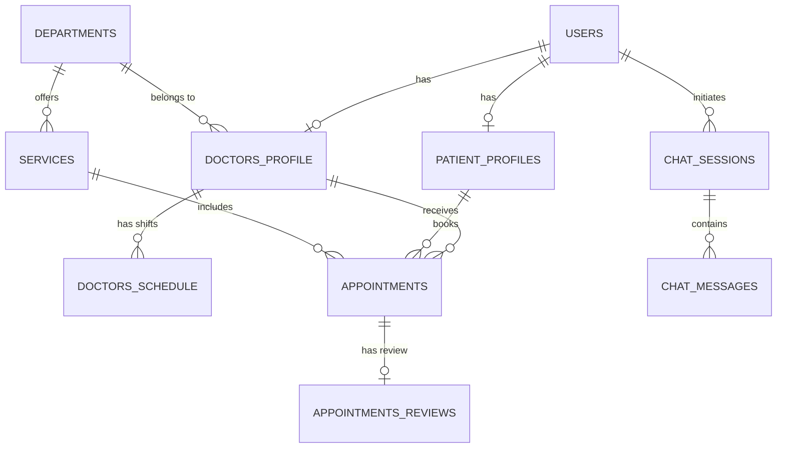

# 🏥 LuminaHealth ClinicOS

**LuminaHealth ClinicOS** is a state-of-the-art, full-stack Clinic Management System equipped with an AI-powered assistant for dynamic appointment bookings, patient record management, doctor availability scheduling, and clinical service management.

---

## 🚀 Tech Stack

### Backend
* **Framework**: FastAPI (Python 3.14)
* **Database**: PostgreSQL (Neon Serverless PostgreSQL)
* **ORM & Migrations**: SQLAlchemy 2.0 & Alembic
* **Security & Auth**: JWT Tokens (Jose) & Bcrypt password hashing (Passlib)
* **AI Engine**: Groq Llama 3 API Integration

### Frontend
* **Framework**: Next.js 15 (React 19 & App Router)
* **Language**: TypeScript
* **Styling**: Tailwind CSS & Modern Glassmorphic Design System
* **Animations**: Framer Motion

---

## 🗄️ Database Architecture (11 Core Tables across 4 Modules)

The database schema is structured into 4 modular layers:



### Module Breakdown
1. **Core Auth**:
   * `users`: Auth, credentials, and user roles (`patient`, `doctor`, `admin`).
2. **Module 1 — Patients Data**:
   * `patient_profiles`: Extended patient health history, DOB, blood group, emergency contacts, allergies.
3. **Module 2 — Medical Infrastructure & Doctor Profile**:
   * `departments`: Clinical departments and specialties (Pediatrics, Cardiology, Dermatology, etc.).
   * `doctors_profile`: Doctor details, qualifications, experience, consultation fees, ratings, gender.
   * `doctors_schedule`: Doctor weekly shift schedules and slot durations.
4. **Module 3 — Booking Appointments & Services**:
   * `services`: Clinical treatments, procedures, pricing, and durations.
   * `appointments`: Core booking records linking patient, doctor, service, date/time, and status (`pending`, `confirmed`, `completed`, `cancelled`).
   * `appointments_reviews`: Verified patient ratings (1-5 stars) and doctor reviews.
5. **Module 4 — AI Chatbot & Support**:
   * `chat_sessions`: Persistent session tracking and booking state for chatbot visitors.
   * `chat_messages`: Multi-turn chat message logs.
   * `faqs`: Knowledge base questions & answers categorized for customer support.

---

## 🛠️ Project Structure

```text
Clinic/
├── backend/
│   ├── alembic/              # Database migration scripts
│   ├── app/
│   │   ├── api/              # FastAPI route endpoints (auth, chat, deps)
│   │   ├── core/             # Configuration & security utilities
│   │   ├── db/               # DB connection sessions & seed scripts
│   │   │   └── seed_all.py   # Master seed script (10+ records per table)
│   │   ├── models/           # SQLAlchemy database models (11 tables)
│   │   └── schemas/          # Pydantic validation schemas
│   ├── requirements.txt      # Python dependencies
│   └── main.py               # FastAPI entry point
│
└── frontend/
    ├── src/
    │   ├── app/              # Next.js pages & routes
    │   ├── components/       # UI components & AI Chatbot widget
    │   ├── data/             # Static data fallbacks
    │   └── context/          # React Auth & Theme Context
    └── package.json
```

---

## ⚡ Getting Started

### 1. Backend Setup

```powershell
# 1. Navigate to backend
cd backend

# 2. Activate virtual environment
.\venv\Scripts\Activate.ps1

# 3. Install dependencies
pip install -r requirements.txt

# 4. Set up environment variables (.env)
# Create a .env file based on .env.example with your DATABASE_URL and SECRET_KEY

# 5. Run Database Migrations
alembic upgrade head

# 6. Seed Database with Initial Data (10+ records per table)
python -m app.db.seed_all

# 7. Start Backend Server
uvicorn app.main:app --reload --port 8000
```
Backend API will be running live at: `http://localhost:8000` (Docs: `http://localhost:8000/docs`).

---

### 2. Frontend Setup

```powershell
# 1. Navigate to frontend
cd frontend

# 2. Install Node packages
npm install

# 3. Start Next.js Dev Server
npm run dev
```
Frontend web application will be running live at: `http://localhost:3000`.

---

## 🧪 Database Seeding Command

To re-seed the PostgreSQL database with fresh initial records across all 11 tables:

```powershell
python -m app.db.seed_all
```

---

## 📄 License
This project is proprietary and maintained for LuminaHealth Clinic.
