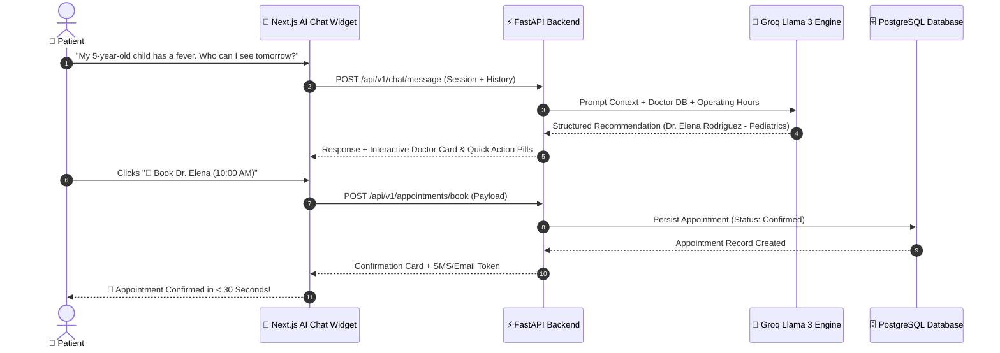

# 🏥 LuminaHealth ClinicOS
### *AI-Powered Intelligent Clinic & Appointment Management System*

[](https://fastapi.tiangolo.com)
[-000000?style=for-the-badge&logo=next.js)](https://nextjs.org)
[](https://groq.com)
[](https://www.postgresql.org)
[](https://www.typescriptlang.org)
[](https://tailwindcss.com)

**LuminaHealth ClinicOS** is a modern clinic management platform designed around a flagship **AI Conversational Booking Engine**. By pairing a high-performance **FastAPI** backend with a **Next.js 16 (React 19)** web application, LuminaHealth transforms clinical scheduling from a multi-step form process into an effortless, conversational AI experience.

---

## 🤖 Flagship Showcase: AI-Powered Smart Booking Engine

The core innovation of LuminaHealth ClinicOS is **Booking Made Easy Using AI**. Instead of navigating complex schedules or filling out long web forms, patients can schedule consultations, find doctors based on symptoms, and query clinic information through an intuitive, multi-turn AI Assistant powered by **Groq Llama 3**.



### Key AI Capabilities

| Feature | Description | Patient Impact |
| :--- | :--- | :--- |
| 🩺 **Symptom-to-Specialist Matching** | Natural language analysis matches health concerns directly to appropriate medical departments (e.g., Pediatrics, Cardiology, Dermatology). | Eliminates confusion on which specialist to book. |
| ⚡ **Instant Conversational Booking** | Multi-turn dialogue guides patients through physician selection, shift time availability, and booking confirmation. | Reduces booking time from 5+ minutes to under 30 seconds. |
| 💳 **Real-Time Fee & Schedule Queries** | Instant context-aware answers for consultation pricing (General: 1,500 PKR, Specialist: 2,500 PKR), operating hours, and location. | Provides 24/7 immediate assistance without phone wait times. |
| 🎛️ **Interactive Rich UI Components** | Embedded quick-reply pills, doctor profile cards, and 1-click confirmation buttons rendered directly inside the chat interface. | Blends natural conversation with fluid, interactive UI widgets. |
| 🛡️ **Medical Guardrails & Fallbacks** | Built-in clinical disclaimers, triage guidance for medical emergencies (+92 300 1234567), and graceful offline fallback handling. | Ensures safe, responsible AI interactions. |

---

## ⚡ Traditional vs. AI-Powered Booking

| Aspect | Traditional Web Booking | 🤖 LuminaHealth AI Booking |
| :--- | :--- | :--- |
| **User Effort** | 7+ steps (Search → Filter → Select Doctor → Pick Slot → Fill Form → Submit) | **1 Conversational Prompt or 1 Click** |
| **Doctor Discovery** | Requires knowing the exact medical specialty | **State symptoms in plain English** |
| **Speed** | 3 – 5 minutes | **< 30 seconds** |
| **Accessibility** | Requires manual web navigation | **Conversational UI with voice-ready assistant** |
| **Support** | Limited to business office hours | **24/7 Intelligent Virtual Care Assistant** |

---

## 🌐 Full-Stack System Architecture

```text
                                  +-----------------------+
                                  |   Next.js 16 Client   |
                                  |  (React 19, Tailwind) |
                                  +-----------+-----------+
                                              |
                                              | REST API / HttpOnly Cookie Auth
                                              v
                                  +-----------+-----------+
                                  |   FastAPI REST Engine  |
                                  |    (Python 3.14+)     |
                                  +-----+-----------+-----+
                                        |           |
                     +------------------+           +-------------------+
                     |                                                  |
                     v                                                  v
     +---------------+---------------+                  +---------------+---------------+
     |    Groq LLM AI Integration    |                  |  PostgreSQL Database (Neon)   |
     |   (Llama 3 Chat Engine)       |                  | (SQLAlchemy 2.0 & Alembic)    |
     +-------------------------------+                  +-------------------------------+
```

---

## ✨ Additional Features

### 👨‍⚕️ Patient Web Portal
* **Doctor Directory & Directory Filtering**: Filter physicians by specialty, gender, consultation fee, and shift availability.
* **Services Catalog & Pricing Matrix**: Transparent pricing cards for clinical procedures, diagnostic tests, and consultations.
* **Patient Resources**: Health blog insights, interactive FAQ accordions, and contact support forms.

### 🔐 Security & User Management
* **Role-Based Access Control**: Granular permission handling for `patient`, `doctor`, and `admin` roles.
* **Secure Authentication**: Password hashing using Bcrypt, session management via JWT tokens stored in HttpOnly cookies.

---

## 📂 Repository Layout

```text
Clinic/
├── backend/
│   ├── alembic/                # Database migration scripts and configurations
│   ├── app/
│   │   ├── api/                # API endpoints and dependency injections
│   │   │   ├── deps.py         # Auth & DB session dependencies
│   │   │   └── v1/             # API routes (auth, chat, endpoints)
│   │   │       └── endpoints/
│   │   │           ├── auth.py # User registration, login, JWT cookies
│   │   │           └── chat.py # Groq AI integration & chat logic
│   │   ├── core/               # Configuration & security settings
│   │   ├── db/                 # Connection setup & master seed scripts
│   │   ├── models/             # SQLAlchemy ORM models (11 core tables)
│   │   └── schemas/            # Pydantic schemas for data validation
│   ├── main.py                 # FastAPI application entry point
│   └── requirements.txt        # Python backend dependencies
│
└── frontend/
    ├── src/
    │   ├── app/                # Next.js App Router pages
    │   │   ├── book-appointment/ # Interactive appointment booking
    │   │   ├── doctors/          # Doctor directory & filtering page
    │   │   ├── services/         # Services catalog
    │   │   └── fees/             # Transparent pricing matrix
    │   ├── components/         # Reusable UI & Framer Motion Chatbot widget
    │   ├── context/            # React Auth and Theme context providers
    │   └── data/               # Static fallback data
    └── package.json            # Node.js dependencies
```

---

## 🗄️ Data Model Summary

The relational PostgreSQL database contains 11 core tables divided into 5 modular domains:
1. **Core Auth (`users`)**: Credentials and roles (`patient`, `doctor`, `admin`).
2. **Patient Profiles (`patient_profiles`)**: Health history, DOB, blood group, emergency contacts.
3. **Medical Infrastructure (`departments`, `doctors_profile`, `doctors_schedule`)**: Specialties, doctor credentials, shift hours.
4. **Appointments & Reviews (`services`, `appointments`, `appointments_reviews`)**: Booking records, statuses, patient ratings.
5. **AI Conversational State (`chat_sessions`, `chat_messages`, `faqs`)**: Persistent chat history and FAQ knowledge base.

---

## 🚀 Quick Start Guide

### Prerequisites
* **Python**: 3.10+ (Python 3.14 recommended)
* **Node.js**: 18.x or higher
* **Database**: PostgreSQL (Local or Cloud Serverless)

---

### 1. Backend Setup

```bash
# 1. Change to backend directory
cd backend

# 2. Create & activate virtual environment
python -m venv venv

# Windows (PowerShell)
.\venv\Scripts\Activate.ps1
# Linux/macOS
source venv/bin/activate

# 3. Install backend packages
pip install -r requirements.txt

# 4. Set up environment variables (.env)
# Create a .env file with DATABASE_URL, SECRET_KEY, and GROQ_API_KEY

# 5. Run database migrations & seed initial records
alembic upgrade head
python -m app.db.seed_all

# 6. Launch FastAPI server
uvicorn app.main:app --reload --port 8000
```
* **API Documentation**: `http://localhost:8000/docs`

---

### 2. Frontend Setup

```bash
# 1. Change to frontend directory
cd frontend

# 2. Install dependencies
npm install

# 3. Start Next.js development server
npm run dev
```
* **Web Application**: `http://localhost:3000`

---

## 📄 License
This repository is maintained for **LuminaHealth Clinic**. All rights reserved.
